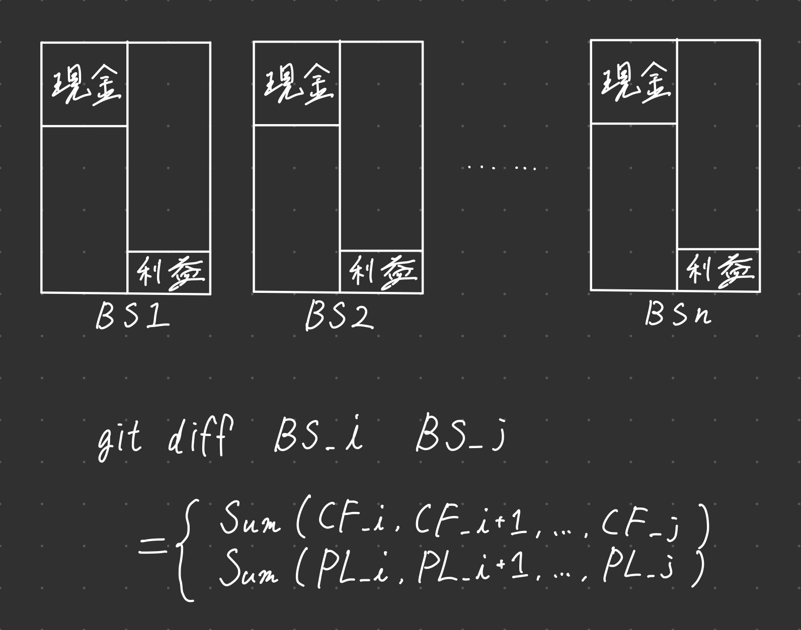

# なにこれ

* 静的型付け言語
* コンパイル言語

を使うといつか黒閃が撃ててプログラミングの核心を掴めるらしいと聞いたので習作。

# 意識すること

関連して聞いた話２つの一番大事そうに思えたことだけをやる。

あんまり多くを最初から意識出来るほど器用ではないので。

## 「データ」「処理」「どのように適用するか」の組み合わせで考える。

- data
  - (= listとか)
- method
  - (= function)
- way to applying method
  - (= mapとか)

## I→処理→Oの構造が再帰になることを意識する。

システムはinput→処理→outputと構造を一般化できる。

動画サイトだったら、「動画をアップロードする（I）→見れる（O）」

動画をアップロードする部分だけ見てもエンコードとか、永続化ストレージに保存するとか、ブレイクダウンできる。

全てがI→処理→Oである再帰的な構造を意識したままツリー上にブレイクダウンしていく。

# ディレクトリ構造

- これ
  - 各習作
    - （プロジェクト単位でGitHubActionsを管理しやすいようsubmoduleとして定義する。）
  - img
    - このリポジトリ関連の画像

# 作ろうと思っているもの

  
時期の異なるBS同士の差分はその間のPLの総計が利益の差分とその間のCFの総計が現金の差分とそれぞれ一致する筈なので、単にBSをコミットすると任意の期間間の利益の合計、現金の増減の合計が、gitの差分として自動で作れるはず。みたいなやつ。

  

  
いいね数が一定以下のツイートを機械的に削除するツール。

  
エディタやターミナルから警告、エラーを抽出しAIに投げてコンパイルが通るまで修正を適用するツール。

  
Markdownの階層構造をトグルリストに変換するツール。トグルリストが好きなので。

